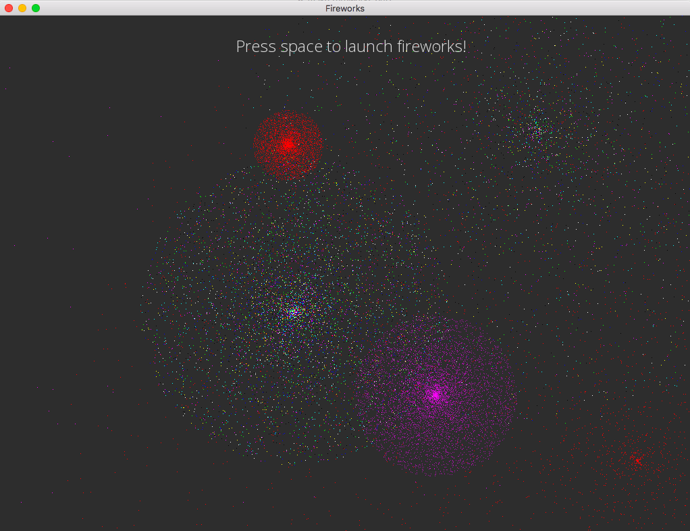

# Fireworks Simulation
Physics simulation for fireworks using SFML.

This program uses single point vertices to represent firework particles. The fireworks each start with different initial velocities and go to different heights before exploding at its peak.

